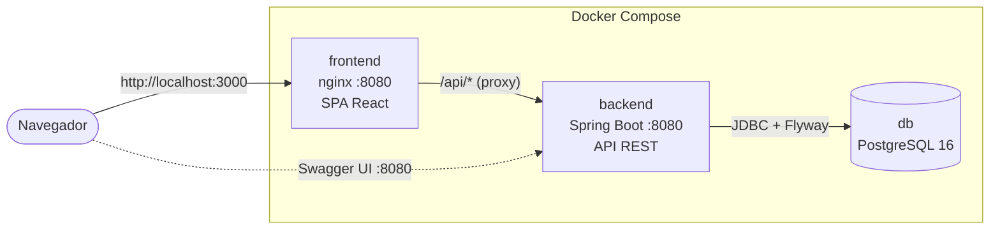
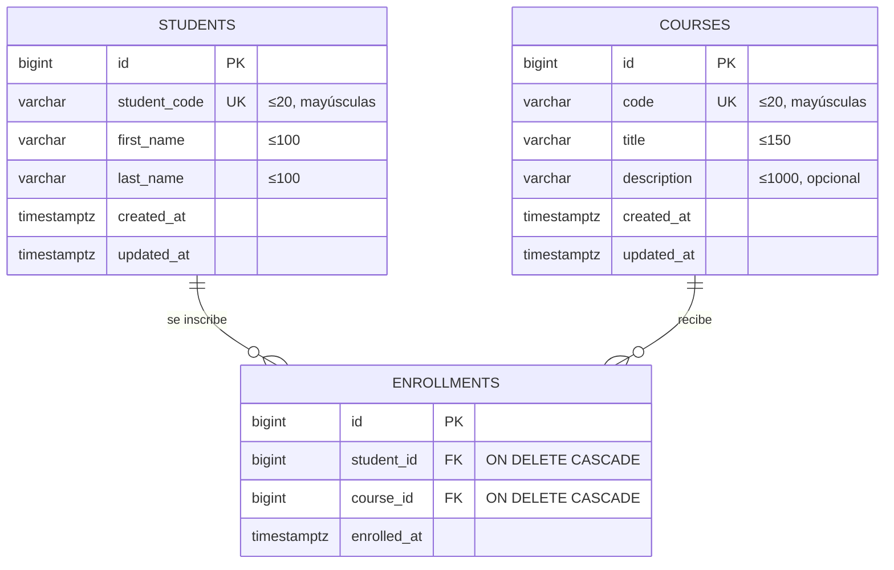
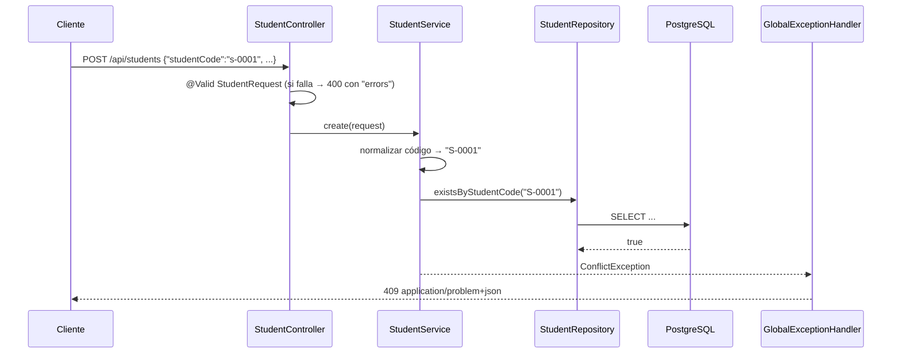

# Arquitectura y decisiones técnicas

- [Visión general](#visión-general)
- [Modelo de datos](#modelo-de-datos)
- [Backend](#backend)
- [Frontend](#frontend)
- [Despliegue con Docker](#despliegue-con-docker)
- [Decisiones técnicas](#decisiones-técnicas)
- [Limitaciones y mejoras futuras](#limitaciones-y-mejoras-futuras)

## Visión general



- El navegador solo habla con **nginx**. nginx sirve los archivos de la SPA y reenvía `/api/*` al
  backend dentro de la red de Compose. Al ser el **mismo origen** no hace falta configurar CORS, y
  el backend no necesita estar expuesto al usuario final (se publica el puerto 8080 solo para Swagger).
- La **API** es *stateless*: cada petición abre su transacción, consulta PostgreSQL y responde JSON.
- El esquema de la base lo controla **Flyway**; Hibernate solo valida que las entidades coincidan
  (`ddl-auto: validate`).

## Modelo de datos



- `UNIQUE(student_id, course_id)` en `enrollments` impide inscripciones duplicadas en la propia base.
  El índice de esa restricción también acelera la consulta "clases de un estudiante". Para "estudiantes
  de una clase" hay un índice adicional en `course_id`.
- Migraciones en `backend/src/main/resources/db/migration`: `V1` estudiantes, `V2` clases,
  `V3` inscripciones. Los datos de ejemplo están en `db/seed/R__demo_data.sql`.

## Backend

### Organización: capas dentro de cada módulo

```
com.hexagon.s4
├── common
│   ├── exception   GlobalExceptionHandler, NotFound/Conflict/BadRequestException
│   ├── web         PageResponse, SearchPatterns, SortValidator
│   └── config      OpenApiConfig
├── student         Student, StudentRepository, StudentService, StudentController, dto/
├── course          Course, CourseRepository, CourseService, CourseController, dto/
└── enrollment      Enrollment, EnrollmentRepository, EnrollmentService, EnrollmentController
```

Cada módulo sigue el mismo flujo **controller → service → repository**:

| Capa | Responsabilidad | No hace |
|---|---|---|
| Controller | HTTP: rutas, `@Valid`, códigos de estado, header `Location`, campos de orden permitidos | Reglas de negocio |
| Service | Reglas de negocio y transacciones: normalizar códigos, detectar duplicados, existencia de recursos | Saber de HTTP |
| Repository | Acceso a datos con Spring Data JPA y consultas JPQL de búsqueda y relación | Lógica |
| DTO (`record`) | Contrato de la API, separado de la entidad JPA | — |

Dependencias entre módulos: `enrollment` usa los **servicios** de `student` y `course` (nunca sus
repositorios), y `student` y `course` no conocen a `enrollment`. Por eso las rutas de la relación
(`/students/{id}/classes`, `/classes/{id}/students/...`) viven en `EnrollmentController`.

### Recorrido de una petición

`POST /api/students` con un código que ya existe:



Si el código está libre, el servicio guarda la entidad y el controlador responde **201** con el
recurso creado y el header `Location: /api/students/{id}`.

### Manejo de errores

`GlobalExceptionHandler` (`@RestControllerAdvice`) traduce cada error a **Problem Details (RFC 7807)**:

| Situación | Excepción | HTTP |
|---|---|---|
| Campos inválidos | `MethodArgumentNotValidException` | 400 + mapa `errors` |
| JSON mal formado, id no numérico | manejadas por `ResponseEntityExceptionHandler` | 400 |
| Campo de orden no permitido | `BadRequestException` | 400 |
| Recurso inexistente | `NotFoundException` | 404 |
| Código duplicado | `ConflictException` | 409 |
| Duplicado por concurrencia (lo detecta la restricción de la base) | `DataIntegrityViolationException` | 409 |
| Cualquier otro error | `Exception` (se registra en el log) | 500 sin detalles internos |

## Frontend

```
src/
├── api/          client.ts (fetch + ApiError), students.ts, courses.ts, enrollments.ts, types.ts
├── hooks/        useStudents, useCourses, useEnrollments (TanStack Query), useListParams (estado en la URL)
├── components/   AppLayout, tablas, formularios, modales, estados de lista, 404
├── pages/        StudentsPage, StudentDetailPage, CoursesPage, CourseDetailPage, NotFoundPage
├── lib/          schemas (Zod), forms (errores de API → campos), notify, format
└── theme.ts      tokens de Stitch convertidos a un tema de Mantine
```

- **Datos del servidor con TanStack Query.** Cada consulta tiene una clave jerárquica
  (`['students', 'list', params]`, `['students', 'detail', id]`). Después de cualquier escritura se
  invalidan los árboles `students` y `courses`, porque cada uno aparece en el detalle del otro.
  Mientras llega una página nueva se sigue mostrando la anterior (`keepPreviousData`), sin parpadeos.
- **Estado de la lista en la URL.** `?q=&page=&sort=` (hook `useListParams`). Recargar, volver atrás
  o compartir el enlace mantiene la misma vista. La búsqueda espera 300 ms después de la última tecla
  antes de consultar.
- **Formularios.** React Hook Form con esquemas Zod que replican las reglas del backend, para
  responder al instante. El backend sigue siendo la fuente de verdad: `applyApiErrors` coloca los
  errores 400 en cada campo y el 409 en el campo código, con un mensaje en español.
- **Errores y estados.** `ApiError` conserva el status y los errores por campo. Un fallo de red se
  representa con status 0 ("No se pudo conectar con el servidor"). Las consultas no se reintentan
  ante errores 4xx.

## Despliegue con Docker

| Imagen | Etapa de build | Imagen final | Detalles |
|---|---|---|---|
| backend | `maven:3.9-eclipse-temurin-21`: dependencias en una capa cacheada, luego `package` | `eclipse-temurin:21-jre-alpine` (~270 MB) | Usuario `app` sin privilegios, healthcheck en `/actuator/health` |
| frontend | `node:22-alpine`: `npm ci` y `npm run build` | `nginx-unprivileged:stable-alpine` (~60 MB) | Fallback a `index.html`, caché inmutable para `/assets`, gzip, proxy de `/api` |

- `depends_on: condition: service_healthy` encadena el arranque: la API no arranca sin la base lista,
  y nginx no arranca sin la API sana.
- Las pruebas no se ejecutan al construir las imágenes, sino en la CI: Testcontainers necesita Docker,
  y ejecutarlo dentro de un `docker build` no es buena práctica.
- Detrás del proxy, `server.forward-headers-strategy: framework` hace que Spring use los headers
  `X-Forwarded-*`. Así, el header `Location` apunta a la URL pública (`http://localhost:3000/...`).

## Decisiones técnicas

**1. Capas por módulo en lugar de arquitectura hexagonal.**
El dominio es un CRUD con una relación muchos a muchos. Una arquitectura de puertos y adaptadores
agregaría interfaces y mapeos sin beneficio real a este tamaño. Agrupar por módulo
(`student/`, `course/`, `enrollment/`) mantiene juntas las piezas de cada funcionalidad. Agregar una
entidad nueva consiste en crear un paquete con el mismo patrón, sin tocar los existentes.

**2. "Class" se llama `Course` en el código.**
`Class` choca con `java.lang.Class` y es palabra reservada en TypeScript. La API conserva el vocabulario
del enunciado (`/api/classes`) y el código usa `Course` de punta a punta.

**3. La inscripción es una entidad explícita, no un `@ManyToMany`.**
Una tabla propia permite guardar `enrolled_at` y dejar que la base rechace duplicados con
`UNIQUE(student_id, course_id)`. También da control directo sobre las consultas de la relación y su
orden, y no carga colecciones dentro de `Student` y `Course`.

**4. El borrado en cascada lo hace la base de datos.**
Las FK de `enrollments` tienen `ON DELETE CASCADE` (reflejado con `@OnDelete` en la entidad). Borrar
un estudiante o una clase es una sola sentencia, atómica, sin cargar inscripciones en memoria. La UI
informa cuántas inscripciones se perderán antes de confirmar.

**5. Los duplicados se controlan en dos niveles.**
El servicio comprueba si el código existe y responde 409 con un mensaje claro. Si dos peticiones
llegan al mismo tiempo, la restricción `UNIQUE` de la base las detiene igual, y el manejador de
errores también responde 409.

**6. Inscribir es un `PUT` idempotente.**
`PUT /classes/{classId}/students/{studentId}` deja al estudiante inscrito sin importar cuántas veces
se repita la petición. Un doble clic o un reintento no generan errores ni duplicados. Quitar una
inscripción inexistente sí responde 404, para que el cliente sepa que no había nada que borrar.

**7. Códigos normalizados.**
Se guardan sin espacios y en mayúsculas. Así, `math-101` y `MATH-101` no pueden coexistir, y la
restricción `UNIQUE` del esquema basta, sin índices funcionales.

**8. Errores en formato Problem Details (RFC 7807).**
Usan el estándar que trae Spring (`ProblemDetail`), de modo que todas las respuestas de error tienen la
misma forma. El mapa `errors` permite al frontend mostrar cada mensaje en su campo.

**9. Lista de campos de orden permitidos.**
Sin ella, ordenar por un campo inexistente durante una búsqueda producía un 500 desde Hibernate.
Validar el parámetro en el controlador devuelve un 400 explicativo e impide ordenar por campos que
no se quieren exponer.

**10. Búsqueda con `LIKE` sin distinguir mayúsculas y con comodines escapados.**
Es suficiente para el volumen esperado y no requiere extensiones de PostgreSQL. `%` y `_` se escapan
para que el usuario busque esos caracteres de forma literal.

**11. Esquema con Flyway y datos de ejemplo como migración repetible.**
Las migraciones versionadas hacen el esquema reproducible en cualquier máquina. El seed
(`R__demo_data.sql`) usa `ON CONFLICT DO NOTHING`, así que es idempotente y nunca pisa cambios del
usuario. Las pruebas lo excluyen para partir de una base vacía, y `SeedDataTest` verifica que se
aplique correctamente.

**12. Configuración por variables de entorno.**
Ningún secreto vive en el código. En local, `spring.config.import` lee el mismo `.env` que usa
Docker Compose, así que hay una sola fuente de configuración. Dentro de los contenedores se usan las
variables de entorno.

**13. Frontend con Mantine y TanStack Query.**
Mantine aporta componentes accesibles (tablas, modales, formularios, notificaciones), y su paleta
coincide con la del diseño de Stitch. TanStack Query resuelve caché, carga, errores e invalidación,
sin escribir un *store* propio.

**14. Spring Boot 4.1.**
Es la versión estable disponible al iniciar el proyecto (Spring Initializr ya no ofrecía 3.x). Implica
Spring Framework 7, Hibernate 7 y los nuevos *starters* modulares.

## Limitaciones y mejoras futuras

| Limitación | Mejora posible |
|---|---|
| Sin autenticación ni roles (el enunciado no los pide) | Spring Security con JWT/OIDC y roles de administrador y consulta |
| Las listas de la relación (`/students/{id}/classes`) no se paginan | Paginarlas si una clase pudiera tener cientos de inscritos |
| La búsqueda distingue acentos ("perez" no encuentra "Pérez") | Extensión `unaccent` de PostgreSQL o un índice de texto completo |
| Si dos personas editan el mismo registro, se guarda la última edición | Bloqueo optimista con `@Version` y respuesta 409 |
| Los mensajes de error de la API están en inglés; la UI traduce los casos conocidos | Internacionalización de mensajes con `MessageSource` |
| No hay pruebas de interfaz de punta a punta en la CI | Agregar Playwright contra el stack de Docker Compose |
